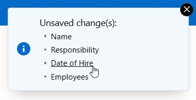

# apex-show-unsaved-changes
Dynamic action plugin to show a message notification listing unsaved changes on the page.

<p>

</p>

See also this [blog post](https://karelekema.hashnode.dev/oracle-apex-show-unsaved-changes-plugin).

The DA is not having any configuration.

In case you want to show the message notification upon the user canceling a Warning on unsaved changes, you can use next code:

Page - Function and Global Variable Declaration:
```
(function(){
    let unloadTriggered = false;

    // beforeunload handler
    window.addEventListener('beforeunload', function (e) {
        if (apex.page.isChanged()) {
            unloadTriggered = true;
        }
    });

    // detect cancel (user stayed on the page)
    window.addEventListener('focus', function () {
        if (unloadTriggered) {
            unloadTriggered = false;
            // use a timeout, so in case unloading is proceeding, it will not reach the trigger
            setTimeout(()=>{
                // it will reach here when user cancels reload/leave site and returns to the page
                apex.event.trigger(apex.gPageContext$, 'unloadcancelled');
            }, 1000);
        }
    });
})();
```
Then in the page designer, you can create the DA upon custom 'unloadcancelled' event.
<h6>API</h6>
lib4x.message.unsavedChanges.addVisibilityCheck(pFunction) : same purpose as [apex.message.addVisibilityCheck()](https://docs.oracle.com/en/database/oracle/apex/24.2/aexjs/apex.message.html#.addVisibilityCheck)


<h4>Plugin Versions</h4>
Version 1.0.0 - build under APEX 24.2
